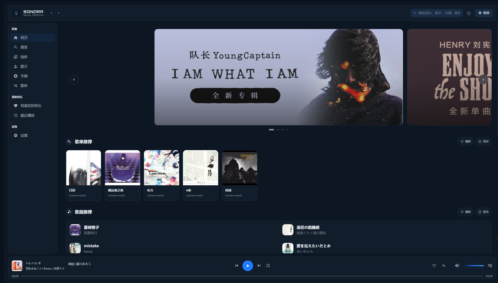
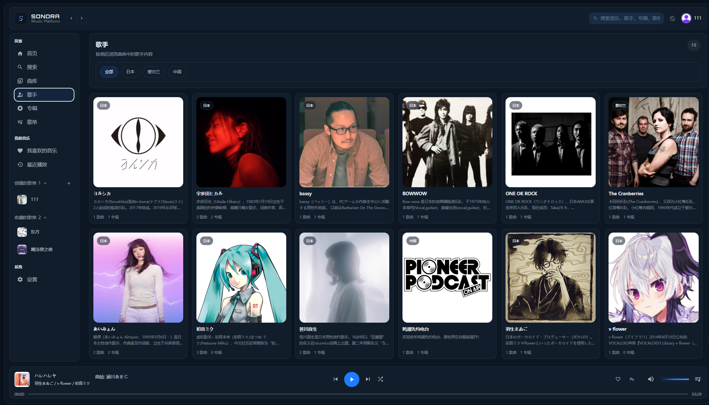
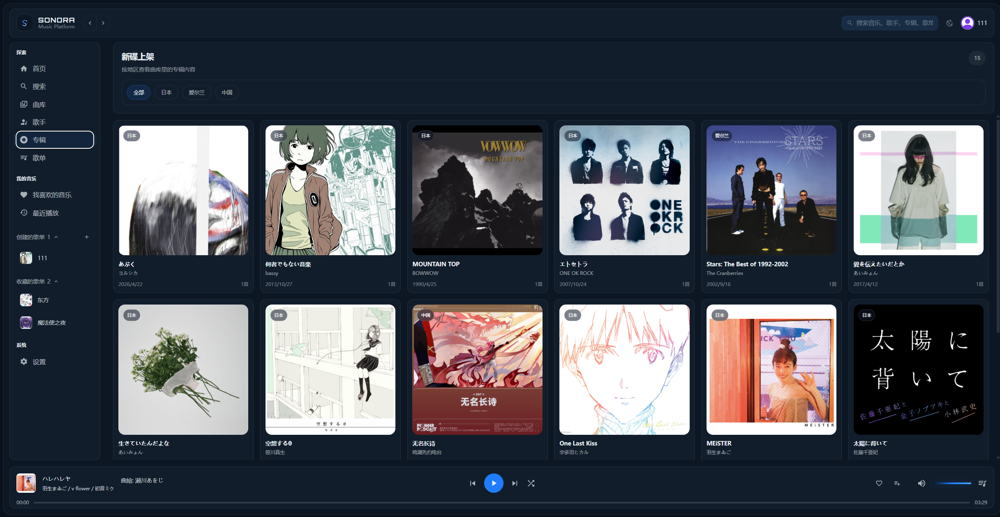
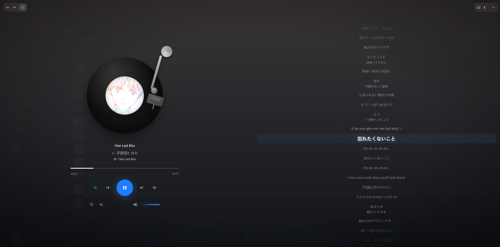
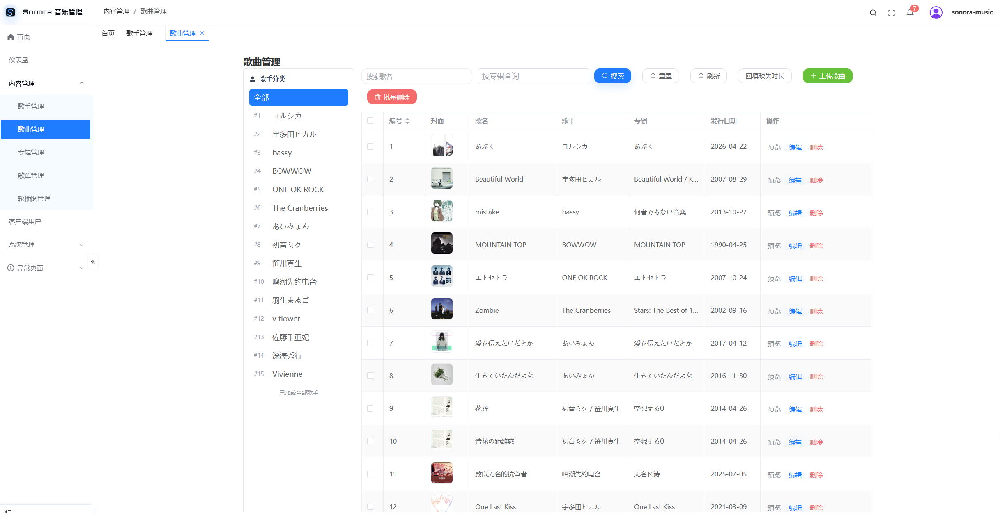
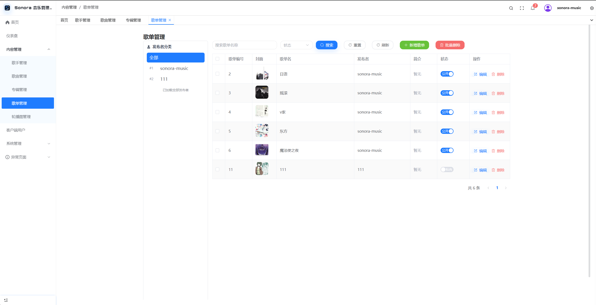
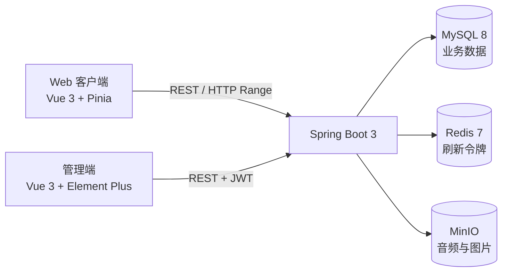

# Sonora Music

Sonora Music 是一个前后端分离的 Web 音乐平台，包含用户客户端、内容管理端和 Spring Boot 后端。项目围绕音乐内容管理、在线播放、歌词、搜索、用户收藏与歌单等完整业务链路展开。

## 项目预览

<details>
<summary>展开截图</summary>








</details>

## 系统架构



```text
sonora-music/
├── sonora-server/       # Java 17 / Spring Boot 3 多模块后端
├── sonora-admin/        # 内容管理端，默认端口 8848
├── sonora-client/       # 用户 Web 客户端，默认端口 5089
├── docs/                # 项目、架构、部署和接口文档
└── images/              # 项目截图
```

## 技术栈

| 模块 | 主要技术 |
|------|----------|
| 后端 | Java 17、Spring Boot 3.3.5、Spring Security、JWT、MyBatis-Plus、Druid、SpringDoc |
| 数据与存储 | MySQL 8、Redis 7、MinIO |
| 管理端 | Vue 3、TypeScript、Element Plus、Pinia、Vite、Tailwind CSS |
| Web 客户端 | Vue 3、TypeScript、Pinia、Vue I18n、Swiper、GSAP、Vite |
| 工程化 | Maven 多模块、pnpm、Docker Compose |

## 已实现功能

### Web 客户端

- 注册、登录、资料与头像维护、密码修改、账号注销
- 首页轮播、歌曲/歌手/专辑/歌单浏览和详情页
- 歌曲、歌手、专辑、歌单联合搜索
- 全局播放器、播放队列、上一首/下一首、顺序/随机/单曲循环
- LRC 歌词同步、滚轮预览和进度跳转
- 喜欢歌曲与默认“我喜欢的音乐”歌单联动
- 创建、编辑、发布、收藏和管理歌单，上传歌单封面
- 深浅色主题、自定义主题色和中/英/日多语言

### 管理端

- 管理员登录、JWT 刷新、后台角色管理、菜单权限分配和动态权限路由
- 用户、歌手、专辑、歌曲、歌单和轮播图管理
- 音频、歌词、头像与封面上传
- 内容状态切换、批量删除和关联数据选择

### 后端

- REST API、统一响应和全局异常处理
- Spring Security + JWT 角色鉴权，刷新令牌存储于 Redis
- MyBatis-Plus 分页和事务化业务操作
- MinIO 对象存储、稳定预览地址与按偏移读取
- 音频接口支持 HTTP Range、`206 Partial Content` 和拖动续播
- 网易云风格api兼容层，用于承接客户端既有数据结构
- Swagger UI 与 OpenAPI JSON 在线接口文档

## 技术亮点

- **流式播放**：浏览器通过 `Range` 请求音频片段，服务端解析字节区间并从 MinIO 按 `offset + length` 读取，避免每次将整首歌曲载入内存。
- **鉴权闭环**：短期访问令牌负责接口访问，刷新令牌保存在 Redis；管理接口使用 `ADMIN` 角色保护，用户私有数据按当前登录用户隔离。
- **数据一致性**：喜欢歌曲会同步写入收藏关系和默认歌单，关键操作使用事务，关联表通过唯一约束防止重复收藏。

## 快速启动

### 环境要求

- JDK 17
- Maven 3.9+
- Node.js 22+
- pnpm 10+
- Docker Desktop / Docker Compose

### 1. 启动基础服务

```bash
cd sonora-server
docker compose up -d
```

Docker Compose 会启动 MySQL、Redis 和 MinIO，并在首次创建数据库卷时执行 `sonora-server/docs/sonora_music.sql`。

### 2. 启动后端

```bash
cd sonora-server
mvn clean install -DskipTests
cd music-admin
mvn spring-boot:run
```

### 3. 启动管理端

```bash
cd sonora-admin
pnpm install
pnpm dev
```

### 4. 启动 Web 客户端

```bash
cd sonora-client
pnpm install
pnpm dev
```

## 本地入口

| 服务 | 地址 | 备注 |
|------|------|------|
| Web 客户端 | `http://localhost:5089` | 用户注册后登录 |
| 管理端 | `http://localhost:8848` | 默认账号 `sonora-music` / `admin123` |
| 后端 API | `http://localhost:8080` | 服务根地址 |
| Swagger UI | `http://localhost:8080/swagger-ui/index.html` | 在线调试接口 |
| OpenAPI JSON | `http://localhost:8080/v3/api-docs` | 机器可读定义 |
| MySQL | `localhost:13306` | 容器内部仍为 `3306` |
| Redis | `localhost:6379` | 刷新令牌存储 |
| MinIO API | `http://localhost:9000` | 对象存储接口 |
| MinIO Console | `http://localhost:9001` | `admin` / `admin123456` |

## 文档导航

- [完整接口文档](docs/API.md)
- [开发与部署指南](docs/DEPLOYMENT.md)
- [后端架构文档](docs/后端架构文档.md)
- [数据库初始化脚本](sonora-server/docs/sonora_music.sql)
- [后端模块说明](sonora-server/README.md)
- [Web 客户端说明](sonora-client/README.md)
- [管理端说明](sonora-admin/README.md)

## 构建与检查

```bash
# 后端
cd sonora-server
mvn clean verify

# 管理端
cd sonora-admin
pnpm typecheck
pnpm build

# Web 客户端
cd sonora-client
pnpm build
```

## 上游与许可

| 模块 | 上游项目 | 说明 |
|------|----------|------|
| Web 客户端 | `XiangZi7/GlassMusicPlayer` | 基于其播放器界面和交互进行业务化改造 |
| 管理端 | `pure-admin/pure-admin-thin` | 基于其后台框架和动态路由能力开发 |

Sonora Music 原创代码及修改部分采用
[PolyForm Noncommercial License 1.0.0](LICENSE)，仅允许非商业用途。
客户端和管理端的上游代码继续适用各自许可证，详见
[第三方许可声明](THIRD_PARTY_NOTICES.md)。

软件许可证不包含音频、歌词、封面、头像等内容资源的版权授权，使用者应确保拥有合法使用权。
