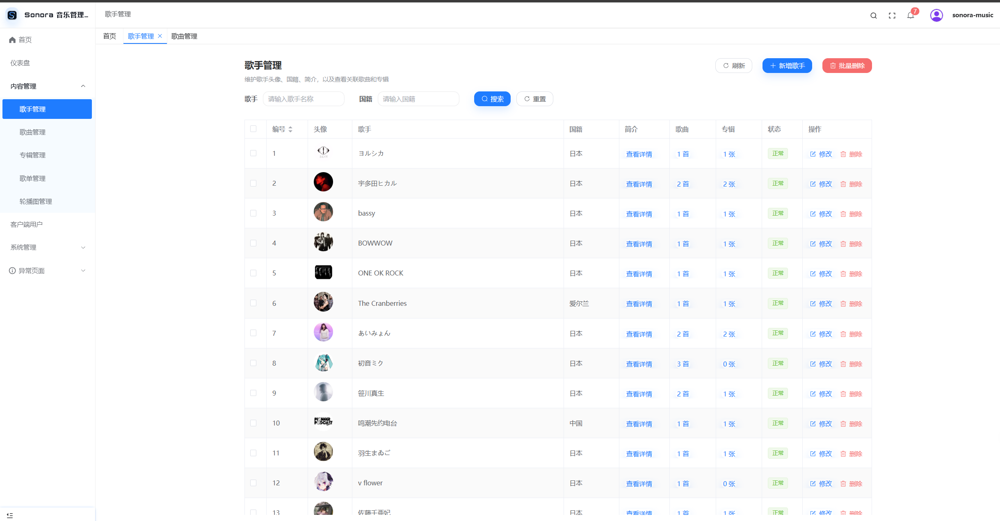
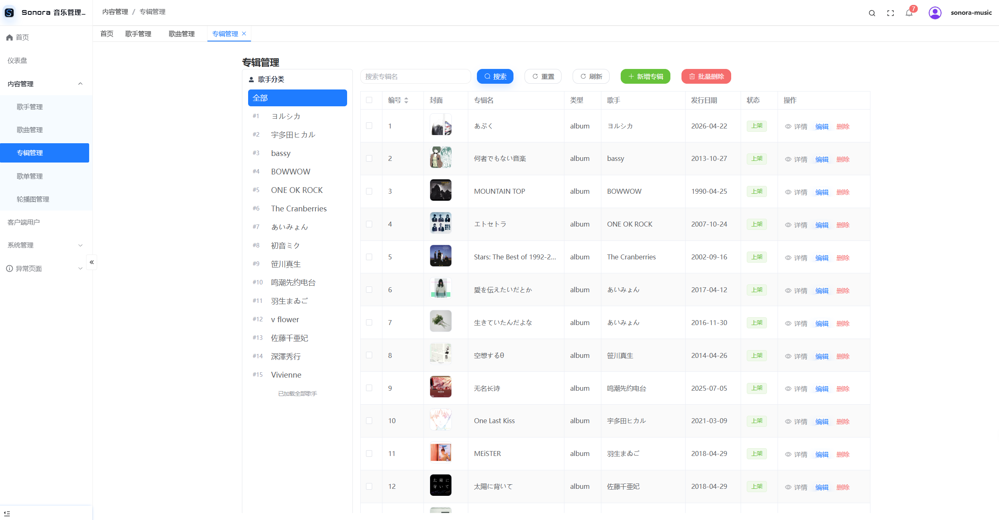
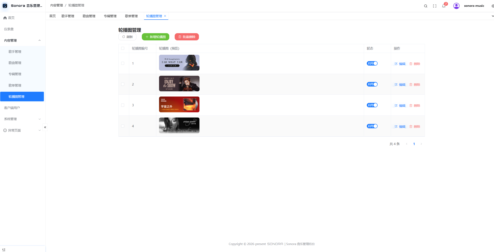

# Sonora Music

Sonora Music 是一个全栈音乐流媒体平台，当前包含管理端、Web 客户端和 Spring Boot 后端。项目的前端部分基于两个前端模板二改：管理端来自 pure-admin-thin，客户端来自 GlassMusicPlayer，后端负责统一数据、权限、文件存储和网易云兼容接口。后端基于Spring Boot开发。

<details>
<summary>预览图</summary>








</details>

## 项目结构

```text
sonora-music/
├── sonora-server/       # 后端服务：Spring Boot 3 + MyBatis-Plus + MySQL + Redis + MinIO
├── sonora-admin/        # 管理端：Vue 3 + Element Plus + Pinia + Vite
└── sonora-client/       # Web 客户端：Vue 3 + Pinia + Vite + Web Audio API
```

## 技术栈

| 模块 | 技术 |
|------|------|
| 后端 | Java 17, Spring Boot 3.3.5, MyBatis-Plus, MySQL 8, Redis 7, MinIO, Spring Security, JWT |
| 管理端 | Vue 3, Element Plus, Pinia, Vite, TypeScript, Tailwind CSS |
| Web 客户端 | Vue 3, Pinia, Vite, TypeScript, Tailwind CSS, Web Audio API |

## 快速启动

```bash
# 1. 启动基础服务：MySQL / Redis / MinIO
cd sonora-server
docker compose up -d

# 2. 编译并启动后端，端口 8080
# 如果本机有多个 JDK，请确认 JAVA_HOME 指向 Java 17
mvn clean install -DskipTests
cd music-admin
mvn spring-boot:run

# 3. 启动管理端，端口 8848
cd ../../sonora-admin
pnpm install
pnpm dev

# 4. 启动 Web 客户端，端口 5089
cd ../sonora-client
pnpm install
pnpm dev
```

## 默认入口

| 入口 | 地址 | 说明 |
|------|------|------|
| 管理端 | `http://localhost:8848` | 默认账号 `sonora-music` / `admin123` |
| Web 客户端 | `http://localhost:5089` | Sonora 注册登录 + 网易云兼容层播放体验 |
| 后端 API | `http://localhost:8080` | Swagger: `/swagger-ui.html` |
| MinIO 控制台 | `http://localhost:9001` | 默认账号 `admin` / `admin123456` |


## 上游来源

| 模块 | 上游项目 | 说明 |
|------|----------|------|
| Web 客户端 | `XiangZi7/GlassMusicPlayer` | 保留视觉和播放器能力，通过后端兼容层对接 |
| 管理端 | `pure-admin/pure-admin-thin` | 保留后台框架和权限路由能力，业务页已改为 Sonora 内容管理 |
