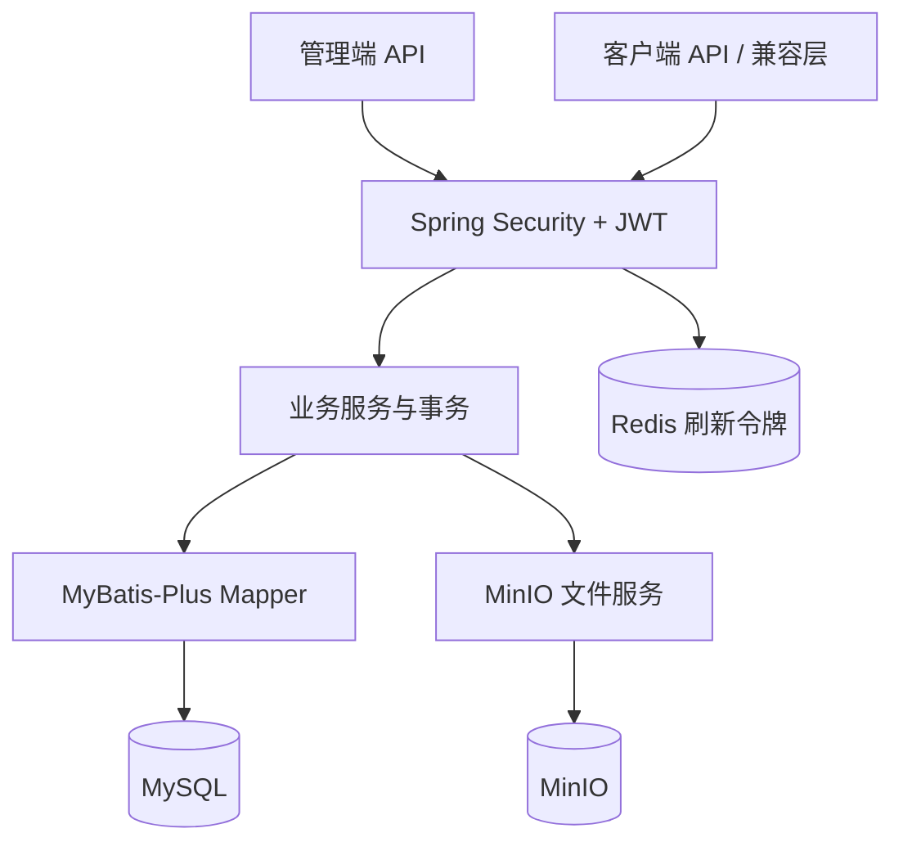

# Sonora Music 后端架构文档

> 最后更新：2026-06-19

## 1. 架构定位

Sonora Music 后端是一个模块化单体应用：业务模块在同一 Spring Boot 进程内协作，共享 MySQL、Redis 和 MinIO。当前体量下，模块化单体能够降低部署和分布式事务复杂度，同时保留按领域继续拆分的空间。



## 2. 基础信息

| 项目 | 值 |
|------|----|
| Java | 17 |
| Spring Boot | 3.3.5 |
| 构建方式 | Maven 多模块 |
| ORM | MyBatis-Plus 3.5.7 |
| 数据库 | MySQL 8 + Druid 连接池 |
| 鉴权 | Spring Security + JWT |
| 辅助存储 | Redis 7、MinIO |
| 接口文档 | SpringDoc OpenAPI |

## 3. 模块结构

```text
sonora-server/
├── pom.xml
├── docker-compose.yml
├── docs/sonora_music.sql
├── music-common/     # 统一响应、异常、常量、工具
├── music-model/      # 实体和数据模型
├── music-mapper/     # MyBatis-Plus Mapper
├── music-service/    # 服务、事务和领域逻辑
├── music-security/   # JWT 过滤器与授权规则
├── music-file/       # MinIO 上传、预览和分段读取
├── music-client/     # 客户端 API 与兼容层
└── music-admin/      # 管理端 API、配置和启动入口
```

启动类位于 `music-admin/src/main/java/com/sonora/admin/SonoraAdminApplication.java`，通过 `scanBasePackages = "com.sonora"` 扫描全部模块。

模块依赖主线：

```text
music-admin -> music-client / music-security / music-service / music-file
music-client -> music-service / music-mapper / music-file
music-service -> music-mapper / music-file
music-mapper -> music-model
music-model -> music-common
```

## 4. 请求链路

普通受保护请求的处理顺序：

1. 浏览器携带 `Authorization: Bearer <accessToken>`。
2. JWT 过滤器校验签名、有效期和用户角色，并写入 SecurityContext。
3. SecurityConfig 根据路径判断公开、登录或 `ADMIN` 权限。
4. Controller 校验参数并调用服务/Mapper。
5. 事务方法维护多张表的一致性。
6. `R<T>` 包装结果；异常由全局异常处理器转换为稳定 JSON。

管理接口 `/api/admin/**` 仅允许 `ADMIN`。客户端资料和 `/api/client/me/**` 需要登录，内容浏览和兼容层接口公开。

## 5. 核心设计

### 5.1 访问令牌与刷新令牌

访问令牌用于无状态 API 鉴权；刷新令牌用于延长登录状态。管理端刷新令牌保存在 Redis，并在刷新时比对和轮换。Redis 当前不是通用热点缓存，文档与面试陈述不应把尚未实现的缓存能力当作现状。

### 5.2 音频流和 HTTP Range

音频对象保存在 MinIO，数据库只保存对象键与元数据。`GET /api/client/songs/{id}/stream` 支持：

- `Range: bytes=start-end`
- `206 Partial Content`
- `Accept-Ranges: bytes`
- `Content-Range` 与准确 `Content-Length`

服务端把字节范围转换为 MinIO `getObject(offset, length)` 调用，只读取本次需要的区间。这样可以支持进度拖动、断点续播和浏览器按需缓冲，也避免为单次播放在 JVM 堆中创建完整音频副本。

### 5.3 文件地址规范化

数据库优先保存 MinIO 对象键，而不是短期预签名 URL。返回客户端时统一转换为 `/api/files/preview?key=...` 或音频流地址，避免签名过期后图片长期失效，也便于后续接入网关和 CDN。

### 5.4 歌曲、专辑与封面

一首歌曲只关联一个 `albumId`，可以关联多个歌手 ID。歌曲封面与所属专辑封面保持一致；无专辑时使用默认封面。歌单未上传自定义封面时使用第一首有效歌曲封面，没有歌曲时使用默认图。

### 5.5 喜欢歌曲与歌单

用户注册时自动创建类型为 `liked` 的“我喜欢的音乐”歌单。喜欢/取消喜欢歌曲会在事务中同步维护：

- `t_user_favorite` 收藏关系
- 默认喜欢歌单的 `t_playlist_song` 关系
- 需要时刷新的歌单封面

普通自建歌单和默认喜欢歌单通过 `type` 区分，默认喜欢歌单不能按普通歌单删除。

### 5.6 兼容层

`music-client` 提供 `/song/url/v1`、`/playlist/detail`、`/lyric` 等网易云风格路由，把 Sonora 领域模型映射为客户端原有的 `al`、`ar`、`dt`、`tracks` 字段。新业务优先使用 `/api/client/**`，兼容层只承担迁移与旧组件适配。

## 6. 数据模型

| 表 | 职责 | 当前业务状态 |
|----|------|--------------|
| `sys_user` | 管理员与客户端用户 | 使用中 |
| `sys_role`、`sys_user_role` | 角色及用户角色 | 使用中 |
| `sys_permission`、`sys_role_permission` | 管理端菜单权限 | 使用中 |
| `t_artist` | 歌手 | 使用中 |
| `t_album` | 专辑 | 使用中 |
| `t_song` | 歌曲和音频元数据 | 使用中 |
| `t_playlist` | 默认、自建和公开歌单 | 使用中 |
| `t_playlist_song` | 歌单歌曲与排序 | 使用中，歌单+歌曲唯一 |
| `t_user_favorite` | 歌曲/歌单收藏关系 | 使用中，用户+类型+目标唯一 |
| `t_banner` | 首页轮播图 | 使用中 |
| `t_user_history` | 播放历史预留表 | 当前没有正式写入接口 |
| `t_comment` | 历史预留表 | 当前产品已移除评论功能 |

初始化脚本：`sonora-server/docs/sonora_music.sql`。

## 7. 并发与性能边界

当前已经具备：

- Druid 数据库连接池
- MyBatis-Plus 分页和列表数量限制
- HTTP Range + MinIO 分段读取
- JWT 无状态访问鉴权
- 事务和唯一约束保证收藏/歌单关系一致性
- 前端按页或按上限加载推荐与歌单

## 8. 运行与文档

| 服务 | 本地地址 |
|------|----------|
| Spring Boot | `http://localhost:8080` |
| Swagger UI | `http://localhost:8080/swagger-ui/index.html` |
| MySQL | `localhost:13306` |
| Redis | `localhost:6379` |
| MinIO API / Console | `http://localhost:9000` / `http://localhost:9001` |

详细启动方式见 [开发与部署指南](DEPLOYMENT.md)，接口清单见 [API 文档](API.md)。